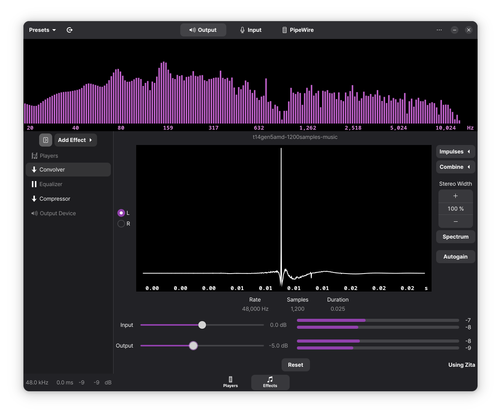
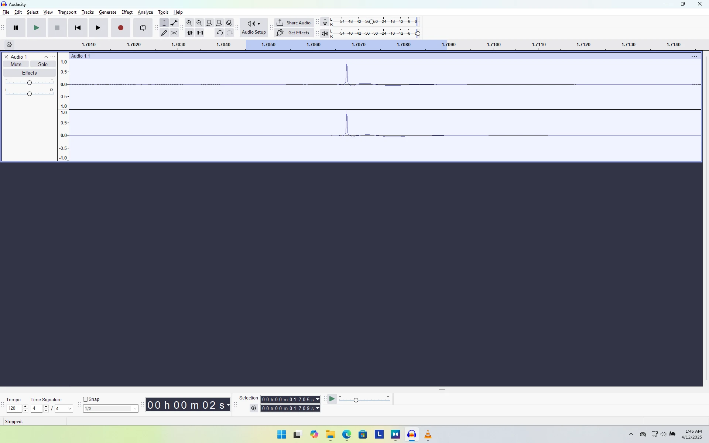

# thinkpad-t14-gen5-amd-impulses

## KR

Thinkpad T14 Gen5 (AMD) Dolby atomos impulse export from windows 11 24h2 for linux easyeffects.

모든 녹음들은 48,000 Hz sample rate 에서 Float32 로 수행되었으며, 결과물은 32bit integer 로 내보냈습니다. 모든 녹음은 중앙 최고점을 기준으로 좌 우 600 samples 를 경계로 잘라냈습니다. (즉 모든 녹음들은 총 1,200 samples 를 가지며 0.025s 의 길이를 가집니다)

이 impulse 를 문제 없이 적용하려면 적어도 output 에 -5.0 dB 를 더해야합니다, 그렇지 않으면 안전하게 출력 가능한 영역을 쉽게 벗어나 원하지 않는 cut-out 이 발생할 수 있습니다.

음원들의 상태에 따라 소리의 우측 편향이 일어날 수 있습니다. 이 Impulse 가 stereo channel 를 가지기 때문에 특히나 그러합니다. 기본적으로 그런 경우 156 Hz 부터 최대 1.6 kHz 내를 Equalizer 로 조율해보세요, 단 Split Channels 를 통해 좌 우 분리를 해주어야합니다.

모든것은 내가 가진 노트북에서 수행되었습니다. 자세한 기종 명은 다음과 같습니다: `21MCCTO1WW ThinkPad T14 Gen 5`. 또한 당시 윈도우의 버전은 Windows 11 24H2 이며 2025-04-12 (YYYY-MM-DD) 기준으로 모든 펌웨어가 최신인 상태로 진행되었습니다.

녹음 방법은 다음 [Github repo](https://github.com/shuhaowu/linux-thinkpad-speaker-improvements) 와 유사합니다만, 1,200 samples 를 정확하게 맞추는 작업이 따로 수행되었습니다.

혹여나 Channel 간의 불균일성을 줄일 방법을 알고 있다면 `me@qwreey.moe` 로 연락하시거나, Issue 를 남겨주세요.

추후 가능하다면 단일 channel 로 새로운 녹음을 올려보겠습니다 (다만 바쁘기에 그럴 수 있을지 모르겠습니다)

아래는 결과에 대한 스크린샷입니다.

# EN

> NOTE: Translated by chatgpt (with stupid system prompt)

All recordings were performed at a 48,000 Hz sample rate in Float32 format, and the output was exported as 32-bit integer. Each recording was trimmed with 600 samples from both the left and right sides around the central peak. (That is, each recording contains a total of 1,200 samples and has a duration of 0.025s.)

To apply this impulse without issues, you need to add at least -5.0 dB to the output. Otherwise, it can easily exceed the safe output range, causing undesired cut-outs.

Depending on the state of the audio source, a rightward sound bias may occur—especially since this impulse contains stereo channels. In such cases, try adjusting the EQ between 156 Hz and up to 1.6 kHz. However, be sure to split the channels before doing so.

Everything was done on my laptop. The exact model is: `21MCCTO1WW ThinkPad T14 Gen 5`. At the time, the Windows version was Windows 11 24H2, and as of 2025-04-12 (YYYY-MM-DD), all firmware was up to date.

The recording method is similar to the one described in this [Github repo](https://github.com/shuhaowu/linux-thinkpad-speaker-improvements), but additional work was done to precisely match 1,200 samples.

If you know any method to reduce channel imbalance, please contact me at `me@qwreey.moe` or leave an issue.

I'll try to upload a new recording with a single channel in the future (though I might not have time).
  
Below is a screenshot of the results.

